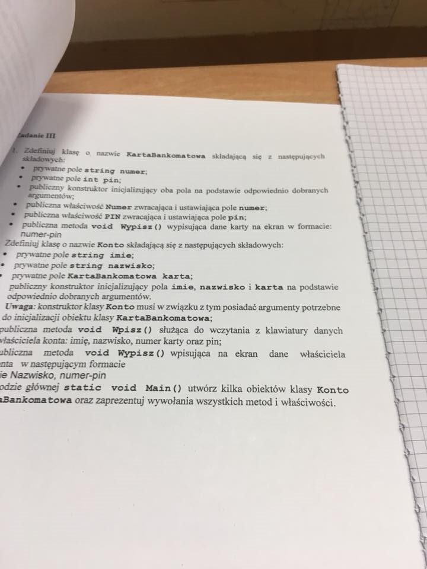

### Polecenie 


```C#
using System;
using System.Collections.Generic;
using System.Linq;
using System.Text;
using System.Threading.Tasks;

namespace Egzamin
{
    public class KartaBankomatowa
    {
        private string numer;
        private int pin;

        public KartaBankomatowa(string numer, int pin)
        {
            this.numer = numer;
            this.pin = pin;
        }
        public string Numer
        {
            get { return numer; }
            set { numer = value; }
        }
        public int PIN
        {
            get { return pin; }
            set { pin = value; }
        }
        virtual public void Wypisz()
        {
            string a = string.Format("{0}-{1}", this.numer, this.pin);
            Console.Write(a);
        }
    }

    public class Konto
    {
        private string imie;
        private string nazwisko;
        private KartaBankomatowa karta;

        public Konto(string imie, string nazwisko, string numer, int pin)
        {
            this.imie = imie;
            this.nazwisko = nazwisko;
            this.karta = new KartaBankomatowa(numer,pin);
        }
        public void Wpisz()
        {
            Console.Write("Imię: ");
            imie = Console.ReadLine();
            Console.Write("nazwisko: ");
            nazwisko = Console.ReadLine();
            Console.Write("numer: ");
            karta.Numer = Console.ReadLine();
            Console.Write("Pin: ");
            int.TryParse(Console.ReadLine(), out int h);
            karta.PIN = h;
        }
        public void Wypisz()
        {
            string Output = String.Format("{0} {1}, {2}-{3}", this.imie, this.nazwisko, this.karta.Numer, this.karta.PIN);
            Console.Write(Output);
        }
    }

    public class Program
    {
        static void Main()
        {
            KartaBankomatowa visa = new KartaBankomatowa("69420", 7312);
            visa.Wypisz();
            visa.Numer = "42069";
            visa.PIN = 2137;

            Console.WriteLine("\nKarta po zmianie danych: " +visa.Numer + " . " + visa.PIN);
            Konto oszczednosciowe = new Konto("Jan", "Kowalski", "255255", 2040);
            oszczednosciowe.Wypisz();
            Konto dodaj = new Konto("", "", "", 0);
            Console.WriteLine("\nDodawanie ");
            dodaj.Wpisz();
            dodaj.Wypisz();
        }
    }
}
```
