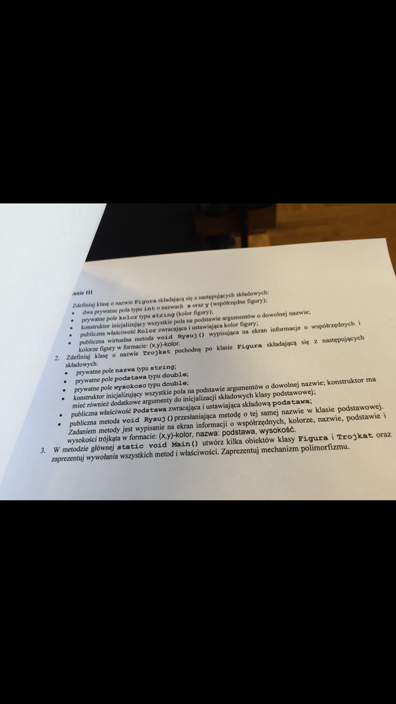

### Polecenie


```C#
using System;
using System.Collections.Generic;
using System.Linq;
using System.Text;
using System.Threading.Tasks;

namespace Egzamin
{
    public class Figura
    {
        private int x;
        private int y;
        private string kolor;

        public Figura(int w1, int w2, string k)
        {
            this.x = w1;
            this.y = w2;
            this.kolor = k;
        }

        public string Kolor
        {
            get { return kolor; }
            set { kolor = value; }
        }

        virtual public void Rysuj()
        {
            string a = string.Format("({0},{1}) - {2}", this.x, this.y, this.kolor);
            Console.Write(a);
        }

    }

    public class Trojkat : Figura
    {
        private string nazwa;
        private double podstawa;
        private double wysokosc;

        public Trojkat(string n, double p, double w, int x, int y, string kolor)
            : base(x, y, kolor)
        {
            this.nazwa = n;
            this.podstawa = p;
            this.wysokosc = w;
        }

        public double Podstawa
        {
            get { return podstawa; }
            set { podstawa = value; }
        }

        override public void Rysuj()
        {

            base.Rysuj();
            string a = String.Format(",{0}:{1},{2}\n", this.nazwa, this.podstawa, this.wysokosc);
            Console.Write(a);
        }
    }

    public class Program
    {
        static void Main()
        {
            Trojkat nowa = new Trojkat("nazwa",2,1,3,7,"czarny");
            nowa.Rysuj();
            Figura jakas = new Figura(6, 9, "zielona");
            jakas.Rysuj();
            Console.WriteLine();
            jakas.Kolor = "Biała";
            Console.WriteLine(jakas.Kolor);
            Trojkat kolejna = new Trojkat("black", 2, 1, 3, 7, "cos");
            kolejna.Podstawa = 23;
            Console.WriteLine(kolejna.Podstawa);
        }
    }
}
```
